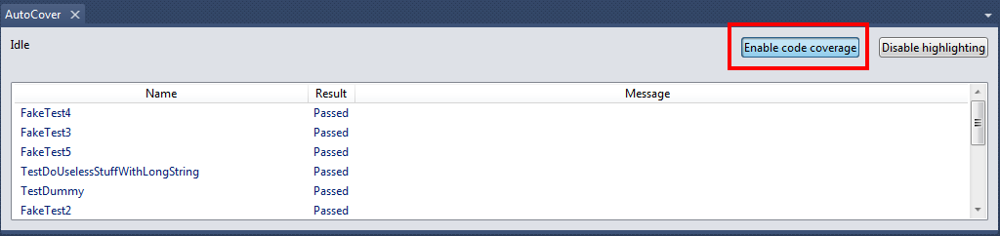
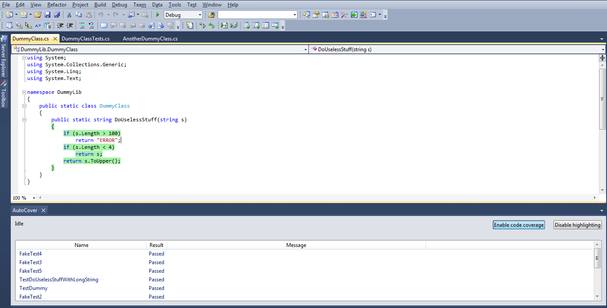

## Using AutoCover

### Download

This step is really simple, just download the Alpha or clone the Git repository and build.
The build this Add-in be sure to install also the Visual Studio 2010 SDK to get the required libraries.
To install it simply double click the VSIX package, confirm and you're ready to go.

### Enable AutoCover on a Solution

First of all go to View -> Windows -> AutoCover and dock the window where you like.
Now open the Solution and click on "Enable code coverage".

### Day by day usage

Once that AutoCover has been enabled every time that you save a file the Add-in will rebuild and run the tests. To improve the performance this check will be done only every 2.5 seconds: if you saved multiple files at the same time AutoCover will run only once.
To further improve the performance only the impacted tests will be rerun and for the same reason the code instrumentation will be done only on modified assemblies.
The first time that you open the solution still requires a full run, be patient.

## A thank you

I'd like to thank Sergiy Sakharov for his great article on CodeProject "[Building .NET Coverage Tool](http://www.codeproject.com/Articles/41722/Building-NET-Coverage-Tool)", without his fantastic work AutoCover wouldn't have been possible.