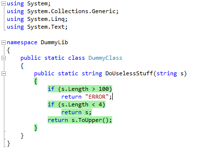

AutoCover is a Continuous Testing Add-in for Visual Studio. It automatically builds and tests your solution and gives feedback on which line is covered.

## Functionality

* Continuous building and testing when a file is saved (currently only MS Tests are supported).
* Smart testing: only the tests that impact the edited file are rerun.
* Smart instrumentation: only new assemblies are instrumented at every run.
* Code highlighting: immediate feedback about your code's coverage.

## Usage

At the moment only a "not recommended" Alpha is available in the Downloads section. It should be considered more a proof of concept than an Alpha: it was done only to demonstrate how it's possible to implement a continuous testing tool in Visual Studio.
Please read the [Documentation](documentation) to understand how to use AutoCover after you installed it.

